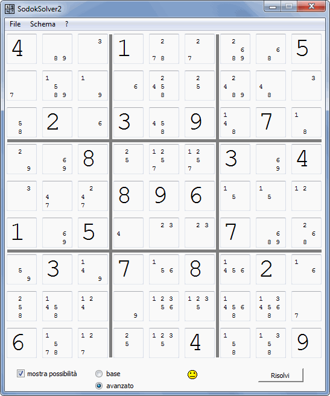

sudoku-solver-2
===============

An application able to solve 9x9 sudokus with rational methods.

The core of the application is a sudoku solver written in C, then there is the GUI written in C++ using the Qt Framework
